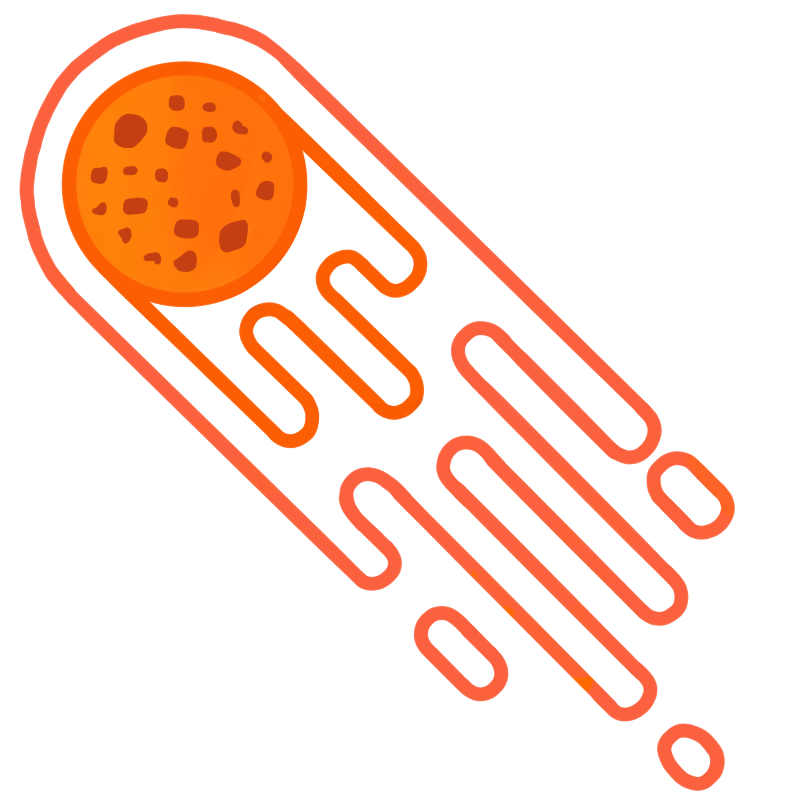

# super-acorn-website

This is the page that im doing to store my projects
https://beellee.github.io/super-acorn-website/

Within the style for the section of my projects I have made several models. 

## First Style in the main page(firstStyle)

[first Style] (images/firstStyleModel)

*this is the main html mold*
    <!-- HEADER (Logo, change style button)-->
    
 
        

        

            <ul>
                <li>Change color mode:</li>
                <li><input class="appleButton" type="checkbox" onclick="changeStyle()" ></li>
            </ul>   
        

     

     <!-- MAIN FONT PAGE (Title, Background image) -->
     

         <h1 class="title">Title</h1>
     

    

*and this is it's style*
/*FONT*/
body{
    Font-Family: 'Sintony', Sans-Serif;
    Font-Size: 15px;
}
.title{
    Font-Family: 'Source Sans Pro', Cursive;
    Font-Size: 90px;
}
.menu button{
    Font-Family: 'Source Sans Pro', Cursive;
    Font-Size: 40px;
}
/* FLEXBOX ONLY (no style)*/
*{
    margin: 0;
    padding: 0;
}
/* THINGS FROM HEADER*/

/* aquí puedes cambiar los márgenes in header (padding)*/
.header {
    display: flex;
    flex-direction: row;
    justify-content: space-between;
    align-items: center;
    padding-left: 4.5vh;
    padding-right: 4.5vh; 
}

ul{
    display: flex;
    list-style-type: none;
    flex-direction: row;
    gap: 10vh;
}

.icon img {
    max-width: 7vmin;
    max-height: auto;
   padding-top: 1vmin;
}

/*apple buttom for the colourful mode */
/*off button*/
    input.appleButton {
        position: absolute;
        right: 5vh;
        top: 2vh;

        appearance: none;
        outline: none;
        
        width: 51px;
        height: 31px;

        background-color: #ffffff;
        border: 1px solid #D9DADC;

        border-radius: 51px;
        box-shadow: inset -20px 0 0 0 #d1d1d1;
        
        transition-duration: 200ms;
    }
    input.appleButton::after{
        content: "";
        position: absolute;
        top: 1px;
        left: 1px;

        width: 26px;
        height: 26px;

        border-radius: 50%;
        box-shadow: 2px 4px 6px rgba(0, 0, 0, 0.2);

        background-color: transparent;
    }
    /*on button*/
    input.appleButton:checked{
        border-color: #4ED164;
        box-shadow: inset 20px 0 0 0 #4ED164;
    }
    input.appleButton:checked::after{
        left: 21px;
        box-shadow: -2px 4px 3px rgba(0, 0, 0, 0.05);
    }

/*THINGS FROM THE MAIN FONT PAGE */
.mainFontPage {
    display: flex;
    min-height: 70vmin;
    justify-content: space-around;
}

.title {
    margin: auto;
    text-align: center;
}